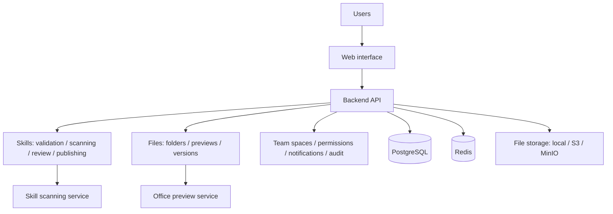

<p align="center">
  
</p>

# SkillHive

[简体中文](README.md) · **English**

**A shared home for your team's AI skills and work files.**

Keep useful methods and the materials they need within your team.

[](LICENSE)


[Overview](#methods-and-materials-each-in-their-place) · [Live demo](#live-demo) · [Product demos](#product-demos) · [Features](#features) · [Deployment](#deployment) · [Development](#development-and-documentation)

## Methods and materials, each in their place

| What you share | How you manage it | What it gives your team |
| --- | --- | --- |
| **Skills hold methods** | Upload AI skill packages, read their instructions and bundled files, and publish versions after validation, security scanning, and review. | Share repeatable workflows for meeting notes, reports, and file processing. Members can download published versions. |
| **Knowledge libraries hold materials** | Organize templates, policies, documents, and spreadsheets in nested folders, with uploads, previews, downloads, and version history. | Give everyday resources a shared home, track changes, and retrieve earlier versions when needed. |
| **Team spaces control access** | Manage members and resources in shared spaces, with access controlled by roles and resource visibility. | Define who can access, publish, and manage resources, with records of key operations. |

For example, a team can keep a meeting-notes skill in the skill library and its templates and project documents in a knowledge library. A new member finds both in the same website, downloads them, and uses them with their preferred AI tool.

**SkillHive manages resources; your AI tools execute the tasks.**

## Live demo

Demo: **[https://skillhive.team](https://skillhive.team)**

On the [login page](https://skillhive.team/login), select the username/password tab and sign in with one of the accounts below. Each is a regular member with access to its permitted team resources.

| Username | Password | Uploaded skill |
| --- | --- | --- |
| `curator_ui` | `Sh!7VoU_FOwrzDZFdcvPQiwuVzxOzyPcUsux` | `web-design-guidelines` |
| `curator_database` | `Sh!78xMg-9z_LvslyHrCWazr1zB30gCtwi2W` | `supabase-postgres-best-practices` |
| `curator_content` | `Sh!7jspLLunXXasAgMlo-vXz1pc9ANLeeaTx` | `baoyu-markdown-to-html` |
| `curator_ai` | `Sh!7x0hZiBWJ_8teeVCdT1NMMEEAtUFVa73u` | `huggingface-gradio` |

## Product demos

### Find files, preview documents, and browse versions

Open a folder in a knowledge library, preview a document, and view or download the historical version you need.


<details>
<summary><strong>Read skill instructions, browse bundled files, and check published versions</strong></summary>

Find a skill, read its instructions, switch to its bundled files to preview `SKILL.md`, and browse published versions.


</details>

<details>
<summary><strong>Publish a skill: choose a team space and visibility</strong></summary>

Select the publish action in the skill library, choose the destination space and visibility, and upload a package. Submitted versions must pass validation, security scanning, and review before publication.


</details>

These recordings show the local Web interface in Chinese. Knowledge-library files are fictional test data; the publishing demo shows the entry point and form settings.

## Who is it for?

- **Teams already using AI tools that want to share useful workflows.** Keep skill packages in one place so members can read their instructions and download published versions.
- **Teams with scattered templates and project files.** Organize original files in folders, share them with the right members, and maintain version history.
- **Teams that need collaboration and governance.** Use team spaces to organize resources, with skill reviews, notifications, and audit records for publishing and updates.

SkillHive brings **skill packages and work files into the same team-space and permission system**, while keeping an appropriate workflow for each: skills are published after validation, scanning, and review; knowledge files become available to authorized members as soon as an upload succeeds.

## Features

| Capability | Description |
| --- | --- |
| Skill management | Upload packages containing `SKILL.md`, read instructions and bundled files, browse version history, and download published versions. Browse by keywords, tags, and sort order. |
| Skill publishing and governance | Validate package structure and metadata, run security scans, review and publish versions, and manage resources through actions such as unpublishing and hiding. |
| Knowledge libraries and folders | Create knowledge libraries in team spaces, organize files in nested folders, and maintain titles, descriptions, and locations. |
| File uploads and discovery | Upload multiple files, track progress, and retry failed uploads. Find files by title, description, or filename, and browse by folder, type, and sort order. |
| Previews and versions | Preview supported formats and download originals. Upload new versions, browse history, download specific versions, and restore earlier versions. |
| Team permissions and traceability | Manage spaces and members. Control operations through platform roles, space roles, and resource visibility, with business notifications and audits of key operations. |

### Skill packages: share repeatable methods

A package uses `SKILL.md` to describe its name, purpose, and execution instructions. It can also include scripts, reference materials, and other assets.

```text
meeting-notes/
├── SKILL.md
├── references/    # Reference materials (optional)
├── scripts/       # Scripts (optional)
└── assets/        # Supporting resources (optional)
```

Example `SKILL.md`:

```markdown
---
name: meeting-notes
description: Organize meeting notes, extract decisions, and list follow-up tasks.
---

# Meeting notes

Read the input notes, group decisions by discussion topic, and list action items
with their owners and deadlines.
```

Skill versions are published after validation, scanning, and review. Normal search and downloads use published versions and remain subject to access permissions.

### Knowledge files: keep originals and track changes

Files are organized as **team space → knowledge library → folder → file**. The upload limit is **100 MiB per file**.

| File type | Supported formats | Access |
| --- | --- | --- |
| PDF | `.pdf` | Online preview and original-file download. |
| Images | `.png`, `.jpg`, `.jpeg`, `.gif`, `.webp` | Online preview and original-file download. |
| Markdown / text | `.md`, `.markdown`, `.txt` | Read online. Markdown supports uploading and displaying companion local images. |
| Word / PowerPoint | `.doc`, `.docx`, `.ppt`, `.pptx` | Preview the first five pages when the Office preview service is enabled, or download the original. |
| Spreadsheets / data | `.xls`, `.xlsx`, `.csv`, `.json` | Upload, download, and version management. |
| Archives | `.zip`, `.rar`, `.7z` | Upload, download, and version management. |

Knowledge files are accessible to authorized members after a successful upload and are not open to anonymous users by default. Office previews display page images, and layout may differ from Microsoft Office. If the service is disabled or rendering fails, members can download the original. See the [Office preview guide](office-preview/README.md).

### Scope

SkillHive provides resource management through the Web interface and does not execute skill scripts. File discovery matches titles, descriptions, and filenames, not document bodies. It does not provide document parsing, vector retrieval, RAG question answering, or online Office co-editing. Members can use downloaded resources with their preferred tools.

## Deployment

SkillHive can run in your team's own environment. The frontend, backend, scanner, database, and Redis can run through Docker. Word / PowerPoint previews use a separate Office preview service.

### Deploying in a new environment

Prepare Docker Engine and Docker Compose, then configure the public URL, authentication, initial administrator, and file storage for your environment.

| Repository configuration | Purpose |
| --- | --- |
| [Deployment configuration](skillhub-docs/09-deployment.md) | Authentication, database, storage, and environment variables. |
| [.env.release.example](.env.release.example) | Runtime configuration template. Copy it to `.env.release` and update the values. |
| [compose.release.yml](compose.release.yml) | Container orchestration for the frontend, backend, scanner, database, and Redis. |
| [compose.office-preview.yml](compose.office-preview.yml) | Optional Word / PowerPoint preview service. |

Replace the default image addresses in the deployment configuration with images built from this repository's source. The default images should not be treated as SkillHive releases. Follow the deployment guide after configuring images, accounts, storage, and secrets.

## Development and documentation

### Architecture



The frontend uses **React 19, TypeScript, Vite, and TanStack Query**. The backend uses **Java 21, Spring Boot, and Maven modules**. The scanning service uses Python; the Office preview service uses LibreOffice, Poppler, and Python.

Skills and knowledge files have independent domain models and share users, team spaces, object storage, and governance facilities. The backend separates controllers, application services, and domain services. The frontend uses generated OpenAPI types to keep API contracts aligned.

### Development commands

Run these commands from the repository root in a Linux / WSL environment with the required development dependencies:

| Command | Purpose |
| --- | --- |
| `make test-backend-app` | Test the backend application module and its dependencies. |
| `make typecheck-web` | Check frontend TypeScript types. |
| `make lint-web` | Check frontend coding conventions. |
| `make test-frontend` | Run frontend unit tests. |
| `make build-frontend` | Build production frontend assets. |
| `make generate-api` | Generate frontend OpenAPI types from a running backend. |

Run `make generate-api` after changing backend API contracts. Do not edit `web/src/api/generated/schema.d.ts` manually. Add new Flyway migrations for database changes; do not modify existing migrations. Before releasing, run container regression checks covering skill publishing and downloads, knowledge-file permissions, uploads, previews, and version operations.

### Future integrations

An open API and CLI access are planned; available capabilities will be documented in future release notes. The existing backend API serves the Web interface and has not been released as a complete public API for users. The API Token management entry point is currently hidden.

## Acknowledgments

Thanks to [iflytek/skillhub](https://github.com/iflytek/skillhub) for the open-source code foundation, and [Tencent/WeKnora](https://github.com/Tencent/WeKnora) for references in knowledge organization, interaction design, and documentation presentation.

## License

This project is licensed under **Apache License 2.0** and retains the relevant copyright and license notices. See [LICENSE](LICENSE) for the full terms. Third-party dependencies and resources remain subject to their respective licenses.
