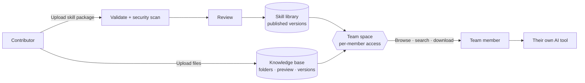
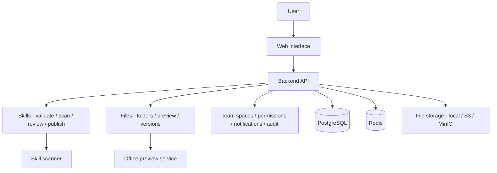

<p align="center">
  
</p>

<h3 align="center">A self-hosted home for your team's AI skills and work files</h3>

<p align="center">
  Skills are reviewed before they are published, files are shared as soon as they are uploaded,<br />
  both live in the same team space, and your data stays on your own server.
</p>

<p align="center">
  <a href="LICENSE"></a>
  
  
</p>

<p align="center">
  <a href="README.md">简体中文</a> · <strong>English</strong>
  <br />
  <a href="#why-skillhive">Why SkillHive</a> · <a href="#live-demo">Live demo</a> · <a href="#product-demos">Product demos</a> · <a href="#features">Features</a> · <a href="#deployment">Deployment</a> · <a href="#development-and-documentation">Development</a>
</p>

## Why SkillHive

<table>
  <tr>
    <td width="33%" valign="top">
      <strong>Self-hosted, your data stays in-house</strong><br /><br />
      Deploy with Docker Compose on your own server or intranet, and store files on local disk, S3 or MinIO. The live demo runs on a single 2-core, 4 GB server.
    </td>
    <td width="33%" valign="top">
      <strong>Skills are reviewed before they reach the team</strong><br /><br />
      Uploaded skill packages pass structure and metadata validation, a <a href="https://github.com/cisco-ai-defense/skill-scanner">Cisco AI Skill Scanner</a> security scan and a human review before they are published, keeping risky scripts out of your team.
    </td>
    <td width="33%" valign="top">
      <strong>Methods and materials in one place</strong><br /><br />
      A team space page lists both its skills and its knowledge bases, and you can search files across knowledge bases. “How to do it” and “what to use” share one entry point.
    </td>
  </tr>
  <tr>
    <td valign="top">
      <strong>Preview files, trace every change</strong><br /><br />
      View PDFs, images and Markdown (with its images) online, and preview the first five pages of Word / PowerPoint files. Every update keeps a version you can download or restore.
    </td>
    <td valign="top">
      <strong>Permissions down to each member</strong><br /><br />
      On top of space roles, set each member to read-only or editable, and decide separately whether they can download. Changes apply immediately, and key operations are recorded in the audit log.
    </td>
    <td valign="top">
      <strong>Works with any AI tool</strong><br /><br />
      Skills use the common <code>SKILL.md</code> format. Members download them and use them with whichever AI tool they prefer; the platform never runs skill scripts itself.
    </td>
  </tr>
</table>

### Compared with the usual way

| | Chat groups, shared drives, personal notes | SkillHive |
| --- | --- | --- |
| Useful AI skills | Scattered across chat history, latest version unclear | Kept in one place with instructions, versions and download counts |
| Skill safety | Used as-is, nobody checks | Published only after validation, security scanning and review |
| Templates and documents | Copies everywhere, hard to tell which is current | One home with traceable version history |
| Finding things | Scroll through chats, ask colleagues | Browse by team space, search across knowledge bases |
| Who can access | Anyone a link is forwarded to | Team members only, with downloads controlled separately |
| Where data lives | A third-party platform | Your own server |

### How it works



For example, a team publishes a meeting-notes skill to the skill library and keeps its meeting templates and project documents in a knowledge base. A new member opens the team space, finds the method and the materials together, downloads them and lets their own AI tool do the work.

## Live demo

Demo site: **[https://skillhive.team](https://skillhive.team)**

On the [sign-in page](https://skillhive.team/login), choose “Username & password” and use any account below. They are ordinary members and only see the team resources they have access to.

| Username | Password | Uploaded skill |
| --- | --- | --- |
| `curator_ui` | `Sh!7VoU_FOwrzDZFdcvPQiwuVzxOzyPcUsux` | `web-design-guidelines` |
| `curator_database` | `Sh!78xMg-9z_LvslyHrCWazr1zB30gCtwi2W` | `supabase-postgres-best-practices` |
| `curator_content` | `Sh!7jspLLunXXasAgMlo-vXz1pc9ANLeeaTx` | `baoyu-markdown-to-html` |
| `curator_ai` | `Sh!7x0hZiBWJ_8teeVCdT1NMMEEAtUFVa73u` | `huggingface-gradio` |

## Product demos

### Find a file, preview it and check its versions

Open a folder in a knowledge base, preview a document, then view and download the version you need.


<details>
<summary><strong>Read a skill's instructions, bundled files and published versions</strong></summary>

Find a skill in the library, read its instructions, preview `SKILL.md` among the bundled files, then check its published versions.


</details>

<details>
<summary><strong>Publish a skill: choose a team space and visibility</strong></summary>

Click “Publish skill” in the skill library, choose the target space and visibility, and upload the package. Each submitted version is validated, scanned and reviewed before it is published.


</details>

These recordings were made in a local Web interface; the knowledge base files are fictional test material.

## Features

| Area | What you can do |
| --- | --- |
| **Skill library** | Upload packages containing `SKILL.md`; read instructions, bundled files and version history; publish after validation, security scanning and review; star, rate and subscribe; browse by keyword, label and sort order; unpublish and hide. |
| **Knowledge bases** | Nested folders; batch uploads with progress and retries; upload Markdown together with its local images or a whole folder; online preview; version history, per-version download and restore; search titles and descriptions, including across knowledge bases. |
| **Team spaces** | One page shows the space's skills and knowledge bases; member management with per-member read-only, editable and download permissions that apply immediately. |
| **Governance** | Platform and space roles; notifications; audit log of key operations. |
| **Interface** | Chinese, English and Russian; light and dark themes; works on phones and narrow screens. |

<details>
<summary><strong>Skill package format</strong></summary>

A skill package uses `SKILL.md` to describe its name, purpose and instructions, and can include scripts, references and assets.

```text
meeting-notes/
├── SKILL.md
├── references/    # reference material (optional)
├── scripts/       # scripts (optional)
└── assets/        # supporting assets (optional)
```

Example `SKILL.md`:

```markdown
---
name: meeting-notes
description: Organize meeting notes into conclusions and follow-up actions.
---

# Meeting notes

Read the meeting notes, summarize conclusions by topic, and list action items with owners and due dates.
```

Skill versions are published after validation, scanning and review. Search and downloads only use published versions, and access is still permission-controlled.

</details>

<details>
<summary><strong>Supported knowledge files</strong></summary>

Files are organized as **team space → knowledge base → folder → file**, up to **100 MiB** per file.

| File type | Formats | How members use them |
| --- | --- | --- |
| PDF | `.pdf` | Preview online, download the original. |
| Images | `.png`, `.jpg`, `.jpeg`, `.gif`, `.webp` | Preview online, download the original. |
| Markdown / text | `.md`, `.markdown`, `.txt` | Read online; Markdown can be uploaded and shown with its local images. |
| Word / PowerPoint | `.doc`, `.docx`, `.ppt`, `.pptx` | View the first five pages when the Office preview service is enabled, or download the original. |
| Spreadsheets / data | `.xls`, `.xlsx`, `.csv`, `.json` | Upload, download and version management. |
| Archives | `.zip`, `.rar`, `.7z` | Upload, download and version management. |

Uploaded files are available to authorized members immediately and are not open to anonymous visitors by default. Office previews are page images, so layout may differ slightly from Microsoft Office; if the service is disabled or a preview fails, download the original. See the [Office preview guide](office-preview/README.md).

</details>

**Scope**: SkillHive manages resources through the Web and does not run skill scripts. Knowledge search matches titles and descriptions (titles default to the file name). It does not search file contents, and it does not provide document parsing, vector search, RAG Q&A or online co-editing.

## Deployment

SkillHive is built for teams that deploy it in their own environment. Every service runs in a container:

| Service | Role |
| --- | --- |
| Web and backend API | Interface and business logic (React / Spring Boot) |
| Skill scanner | Security scanning of skill packages |
| PostgreSQL, Redis | Data and cache |
| File storage | Local disk, S3 or MinIO |
| Office preview (optional) | Word / PowerPoint page previews |

The live demo runs all services on a single 2-core, 4 GB server, with a memory limit on each service. This setup has not been load-tested, so size larger teams on their actual workload.

| Configuration in this repository | Purpose |
| --- | --- |
| [Deployment configuration](skillhub-docs/09-deployment.md) | Authentication, database, storage and environment variables. |
| [.env.release.example](.env.release.example) | Runtime template; copy it to `.env.release` and edit it. |
| [compose.release.yml](compose.release.yml) | Containers for the frontend, backend, scanner, database and Redis. |
| [compose.office-preview.yml](compose.office-preview.yml) | Optional Word / PowerPoint preview service. |

Replace the default image addresses in the deployment configuration with images built from this repository; the default images are not SkillHive releases. Configure images, accounts, storage and secrets, then start the services as described in the deployment guide.

## Development and documentation

### Architecture



The frontend uses **React 19, TypeScript, Vite and TanStack Query**; the backend uses **Java 21, Spring Boot and Maven modules**. The skill scanner uses Python, and the Office preview service uses LibreOffice, Poppler and Python.

Skills and knowledge files have separate domain models and share users, team spaces, object storage and governance. The backend separates controllers, application services and domain services, and the frontend keeps the API in sync through generated OpenAPI types.

### Common development commands

Run these from the repository root in a Linux / WSL environment with the development dependencies:

| Command | Purpose |
| --- | --- |
| `make test-backend-app` | Test the backend application module and its dependencies. |
| `make typecheck-web` | Type-check the frontend. |
| `make lint-web` | Lint the frontend. |
| `make test-frontend` | Run frontend unit tests. |
| `make build-frontend` | Build frontend production assets. |
| `make generate-api` | Generate frontend OpenAPI types from a running backend. |

Run `make generate-api` after changing backend API contracts, and do not edit `web/src/api/generated/schema.d.ts` by hand. Database changes only add new Flyway migrations and never modify existing ones. Before a release, run container regression covering skill publishing and downloads, knowledge file permissions, uploads, previews and versions. See [changelog maintenance](skillhub-docs/changelog-maintenance.md) for how release notes are kept.

### Roadmap

An open API and CLI integration are planned; details will appear in the changelog when they ship. The current backend API serves the Web interface and is not yet published as a complete open API, so API token management is hidden for now.

## Acknowledgements

Thanks to [iflytek/skillhub](https://github.com/iflytek/skillhub) for the open-source foundation, and to [Tencent/WeKnora](https://github.com/Tencent/WeKnora) for reference on knowledge organization, interaction and document display.

## License

This project is licensed under the **Apache License 2.0**, with the relevant copyright and license notices retained. See [LICENSE](LICENSE) for the full terms. Third-party dependencies and assets follow their own licenses.
