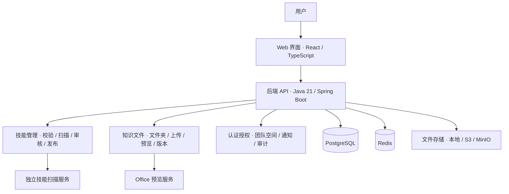

<p align="center">
  
</p>

# SkillHive

**把团队的 AI 技能包和工作资料放在一个地方，方便查找、共享、更新和复用。**

SkillHive 基于 SkillHub 改造：保留技能包的版本、安全扫描和审核，增加按文件夹管理的团队知识库。当前主要通过浏览器使用，适合想先把技能和资料管理好的团队。

[](LICENSE)


[有什么不同](#和其他工具有什么不同) · [为什么这样设计](#为什么这样设计) · [看动图](#看动图了解怎么用) · [交互方式](#交互方式与后续计划) · [功能概览](#功能概览) · [快速开始](#快速开始) · [开发指南](#开发指南) · [参考项目](#参考项目与致谢)

## 这是什么

可以把 SkillHive 理解成 **“团队技能仓库 + 团队文件中心”**。

- **技能库放做事的方法**：例如整理会议记录、撰写报告、处理文件的技能包。成员可以查看说明、包内脚本和参考材料，下载已发布版本，交给自己使用的 AI 工具运行。
- **知识库放做事的资料**：例如模板、制度、项目文档、表格和演示材料。按文件夹整理，支持上传、预览、下载和版本历史。
- **空间决定谁能用、谁能管**：技能和知识库共用团队空间与成员权限，资源访问仍受各自的可见性规则控制。

举个例子：团队可以把“会议纪要整理”技能放进技能库，把会议模板和项目资料放进知识库。新成员从同一个网站找到这些资源，取用需要的版本，再带到自己的 AI 工具里工作。平台负责管理资源，AI 工具负责执行任务；当前取用以网页查看和下载为主。

## 和其他工具有什么不同

| 工具 | 主要解决什么问题 | SkillHive 的侧重点 |
| --- | --- | --- |
| [SkillHub](https://github.com/iflytek/skillhub) | 团队技能包的发布、发现、版本和治理，并提供 CLI/API 等接入方式。 | 在它的技能管理基础上增加独立的知识文件中心，把技能和工作资料放进同一套空间与权限体系；当前先做好 Web 使用流程。 |
| 普通网盘 / 文件管理工具 | 保存、分享和取用文件；具体的预览、版本与权限能力因产品而异。 | 技能包有专门的 `SKILL.md` 格式校验、安全扫描、版本和审核流程。知识文件则按文件夹管理，上传成功即可按权限共享。 |
| RAG 知识库 / [WeKnora](https://github.com/Tencent/WeKnora) 等工具 | 解析文档、检索内容并用于 AI 问答；WeKnora 还提供 Agent 和 Wiki 等能力。 | 保存和管理原文件，不做文档分块、向量检索或知识问答。成员找到资料后，可以交给团队已有的 AI 工具处理。 |

**权限、版本和审核是从 SkillHub 沿用的基础能力。SkillHive 的变化主要是增加知识文件中心，并把当前的使用入口收敛到 Web。** 技能与知识文件拥有独立的数据模型和管理流程，知识库里的 Word、PDF、表格不需要包装成技能包。

## 为什么这样设计

**先解决“东西在哪、谁能用、哪个版本可信”。** 团队的技能、模板和文档往往散在个人电脑或聊天记录里。把它们集中管理，成员才能找到已有资源，更新时也有记录可查。

**技能和资料需要不同的发布规则。** 技能包可能包含指令和脚本，需要校验、扫描与审核；知识文件是日常共享资料，上传成功即可按权限使用。两者共用空间和成员管理，各自保留适合自己的流程。

**AI 执行和问答交给团队选用的工具。** 当前目标是把资源管理好，因此不再额外搭一套聊天、模型和向量检索系统。这样不用为了共享文件先配置模型、处理文档分块、等待索引，再评估答案是否可靠。在线预览只是阅读文件，Word/PPT 的页面图片转换也不用于建立 RAG 索引。

如果你的核心需求是“上传文档后直接提问”，RAG 知识库工具更贴近这个需求；如果你已经有自己的 AI 工具，缺的是统一的技能和资料管理入口，SkillHive 就是为这类场景设计的。

目前知识文件查找匹配标题、描述和文件名，不搜索文件正文。SkillHive 也不执行技能脚本、不提供在线 Office 协同编辑；表格保留上传、下载和版本记录。

## 看动图了解怎么用

以下动图录自本地 Web 界面。知识库使用虚构测试资料，发布演示只展示表单设置。

### 1. 查看技能说明、包内文件和版本

在技能库找到技能，打开说明，切换到包内文件并预览 `SKILL.md`，再查看已发布版本。


### 2. 按文件夹找资料，预览并查看版本历史

知识库按空间组织资料；进入文件夹后可以打开原文件预览，并下载需要的历史版本。


### 3. 从技能库进入发布，选择空间和可见范围

点击技能库顶部的“发布技能”，选择发布到哪个空间、谁能看到，再上传技能包。提交后仍需遵循校验、扫描和审核流程。


## 交互方式与后续计划

**当前版本以 Web 端作为主要交互入口。** 用户通过浏览器完成技能上传与发布、知识文件管理、团队空间协作、审核和个人设置，日常使用无需配置 API Token 或安装命令行工具。

后端 API 为 Web 界面提供服务，并保留部分技能接口的 Token 认证能力；当前尚未作为面向用户的完整开放 API 发布，API Token 管理入口也暂时隐藏。SkillHive 目前不提供独立 CLI。

| 交互方式 | 当前状态与后续方向 |
| --- | --- |
| Web 端 | 当前主要使用方式，提供技能库、知识库、空间权限与管理操作界面。 |
| 开放 API | 后续计划完善并开放，提供接口文档与访问凭证管理，支持外部系统集成和自动化操作。 |
| CLI | 后续计划增加命令行交互，支持终端和自动化流程中的资源管理操作。 |

API 与 CLI 是后续规划，具体能力以未来版本发布说明为准；新增交互方式将沿用现有的用户身份、空间权限和版本规则。

## 功能概览

| 能力 | 说明 |
| --- | --- |
| 技能管理 | 上传包含 `SKILL.md` 的技能包，查看技能说明、包内文件和版本历史，下载已发布版本。 |
| 校验与扫描 | 上传时校验技能包结构及元数据，通过独立扫描服务检查安全问题。 |
| 审核与发布 | 提交技能版本审核，查看审核状态，审核通过后发布；支持下架、隐藏等治理操作。 |
| 技能检索 | 按关键词、标签和排序浏览技能，查看空间归属、技能详情与发布版本；权限控制可见范围。 |
| 知识库与文件夹 | 在团队空间下创建知识库，用多层文件夹组织文件，维护文件标题、描述与所属目录。 |
| 文件上传与预览 | 批量上传文件，查看上传进度并重试失败项；支持 PDF、图片、Markdown、TXT 预览及配套的 Office 预览。 |
| 文件版本 | 文件上传即发布；上传新版本、查看历史版本、下载指定版本，以及恢复历史版本。 |
| 文件查找 | 按标题、描述、文件名查找资料，结合文件夹、文件类型和排序条件浏览文件。 |
| 团队协作 | 管理团队空间及成员，通过平台角色和空间角色控制资源访问与管理操作。 |
| 通知与审计 | 接收审核等业务通知，记录关键管理操作，便于查询和追溯。 |

### 技能包

技能以包含 `SKILL.md` 的包进行上传，`SKILL.md` 使用 YAML frontmatter 描述名称和用途，正文保存技能指令。包中可以附带参考材料、脚本和其他资源。

```text
my-skill/
├── SKILL.md
├── references/    # 参考材料（可选）
├── scripts/       # 脚本（可选）
└── assets/        # 配套资源（可选）
```

`SKILL.md` 示例：

```markdown
---
name: my-skill
description: 整理会议记录，提取讨论结论与后续待办。
---

# 会议记录整理

阅读输入的会议记录，按讨论主题整理结论，并列出待办事项、负责人和期限。
```

技能版本经过包校验、安全扫描与审核后发布。普通检索与下载使用已发布版本，资源访问受相应权限控制。

### 知识文件

知识库按“团队空间 → 知识库 → 文件夹 → 文件”组织资料。单个文件上传上限为 **100 MiB**，支持以下格式：

| 类型 | 格式 | 查看方式 |
| --- | --- | --- |
| PDF | `.pdf` | 在线预览、下载原文件。 |
| 图片 | `.png`、`.jpg`、`.jpeg`、`.gif`、`.webp` | 在线预览、下载原文件。 |
| Markdown / 文本 | `.md`、`.markdown`、`.txt` | 在线阅读；Markdown 支持配套本地图片上传与展示。 |
| Word / PowerPoint | `.doc`、`.docx`、`.ppt`、`.pptx` | 启用 Office 预览服务后查看前五页，或下载原文件。 |
| 表格 / 数据 | `.xls`、`.xlsx`、`.csv`、`.json` | 保存文件与版本，下载原文件。 |
| 压缩包 | `.zip`、`.rar`、`.7z` | 保存文件与版本，下载原文件。 |

Office 预览以页面图片展示，排版可能与 Microsoft Office 存在差异；服务未启用或生成失败时可下载原文件。具体配置见 [Office 预览说明](office-preview/README.md)。

知识文件由团队空间权限控制，默认不向匿名用户开放。上传成功即可供有权限的成员访问，更新文件会保留版本历史。

## 快速开始

### Windows / WSL Docker 启动

当前本地启动入口使用 **WSL Ubuntu-22.04、Docker Engine 和 Docker Compose**。前端、Java 后端、Python 扫描器、数据库及 Redis 均在容器中运行，构建依赖也在容器内安装。

以下步骤用于当前本机环境，依赖本机配套的 `scripts/docker-wsl.ps1`、`compose.wsl-docker.yml` 与 `DOCKER_WSL.md`，这些文件尚未纳入仓库。新环境部署请先阅读仓库中的 [部署配置](skillhub-docs/09-deployment.md)，按实际环境配置服务与账户。

在 PowerShell 中执行：

```powershell
cd E:\MyProjects\skillhive

# 首次运行或修改源码后构建镜像
.\scripts\docker-wsl.ps1 build

# 启动服务并等待健康检查
.\scripts\docker-wsl.ps1 start

# 查看服务状态
.\scripts\docker-wsl.ps1 status
```

启动后可访问：

| 服务 | 地址 |
| --- | --- |
| Web 界面 | [http://localhost:3000/](http://localhost:3000/) |
| 后端健康检查 | [http://localhost:8080/actuator/health](http://localhost:8080/actuator/health) |
| 扫描器健康检查 | [http://localhost:8000/health](http://localhost:8000/health) |

查看日志和停止服务：

```powershell
.\scripts\docker-wsl.ps1 logs
.\scripts\docker-wsl.ps1 stop
```

脚本使用 `compose.wsl-docker.yml`；存在 `compose.office-preview.yml` 时会一并加载 Office 预览服务。首次构建或启动会生成被 Git 忽略的 `.env.docker`，保存本地下载签名密钥。

当前本地配置保留已有账户，不自动创建管理员。首次部署需配置认证与初始管理员，相关环境变量见 [部署配置](skillhub-docs/09-deployment.md)。运行数据与上传文件保存在 Docker 数据卷中，`stop` 会保留数据。本机的启动细节、数据卷与离线构建说明记录在配套文件 `DOCKER_WSL.md` 中。

## 使用流程

### 上传与发布技能

1. 登录 Web 界面，在技能库页面点击“发布技能”。
2. 选择有发布权限的空间，上传包含 `SKILL.md` 的技能包并填写版本信息。
3. 查看包校验、安全扫描及审核结果。
4. 审核通过并发布后，成员可检索技能、查看详情和下载已发布版本。
5. 后续更新继续提交新版本，保留原有版本记录。

### 上传与管理知识文件

1. 进入团队空间中的知识库，创建或选择文件夹。
2. 选择文件批量上传，查看进度，必要时重试失败项。
3. 上传成功后按权限浏览、预览或下载文件。
4. 按关键词、文件夹或类型查找资料，修改文件标题、描述或位置。
5. 内容更新时上传新版本；在版本历史中下载或恢复指定版本。

## 系统架构



| 组件 | 技术与职责 |
| --- | --- |
| `web/` | React 19、TypeScript、Vite、TanStack Query；提供技能、知识库、团队空间、审核和管理界面。 |
| `server/` | Java 21、Spring Boot、Maven 多模块；提供认证授权、业务规则、版本管理、搜索与 API。 |
| `scanner/` | Python 技能安全扫描服务，独立部署并由后端调用。 |
| `office-preview/` | LibreOffice、Poppler 与 Python；生成 Word / PowerPoint 的页面预览。 |
| PostgreSQL | 保存用户、团队空间、技能、知识文件、版本及治理记录；使用 Flyway 管理数据库迁移。 |
| Redis | 承载会话、缓存及相关运行状态。 |
| 文件存储 | 保存技能包、知识原文件及配套资源；支持本地文件和 S3 兼容存储，当前本地 Docker 配置使用文件数据卷。 |

后端通过 `skillhub-app`、`skillhub-domain`、`skillhub-auth`、`skillhub-search`、`skillhub-storage`、`skillhub-infra` 和 `skillhub-notification` 划分职责。技能与知识文件使用独立领域模型，共享用户、团队空间、存储和治理设施。更多说明见 [SkillHive 架构文档](skillhub-docs/skillhive-architecture.md)。

## 开发指南

前端使用生成的 OpenAPI 类型与后端保持接口一致；后端按控制器、应用服务、领域服务分工。新增数据库变更应增加 Flyway 迁移文件，保留已有迁移。

以下命令在具备项目开发依赖的 Linux / WSL 环境中、于仓库根目录执行：

| 命令 | 用途 |
| --- | --- |
| `make test-backend-app` | 测试后端应用模块及其依赖。 |
| `make typecheck-web` | 检查前端 TypeScript 类型。 |
| `make lint-web` | 检查前端代码规范。 |
| `make test-frontend` | 运行前端单元测试。 |
| `make build-frontend` | 构建前端生产资源。 |
| `make generate-api` | 从运行中的后端生成前端 OpenAPI 类型。 |

后端控制器或接口契约改变后运行 `make generate-api`，不要手工修改 `web/src/api/generated/schema.d.ts`。发布前还需进行容器回归，验证技能上传、扫描、审核、下载以及知识文件的权限、上传、预览和版本操作。

## 文档

| 文档 | 内容 |
| --- | --- |
| [SkillHive 架构文档](skillhub-docs/skillhive-architecture.md) | 领域模型、权限规则与模块分工。 |
| [Office 预览说明](office-preview/README.md) | 预览服务、支持格式、运行限制与验证方式。 |
| [扫描服务说明](scanner/README.md) | 技能扫描服务及配置文档入口。 |
| [部署配置](skillhub-docs/09-deployment.md) | 认证、存储、环境变量及部署参数。 |
| [项目工作约定](AGENTS.md) | 当前功能范围、实现要求与验证约定。 |

## 参考项目与致谢

感谢以下开源项目提供的源码基础、设计思路与文档参考：

| 项目 | 参考内容 |
| --- | --- |
| [SkillHub · iflytek/skillhub](https://github.com/iflytek/skillhub) | SkillHive 的源码基础，沿用并调整技能上传、版本管理、安全扫描、团队权限、审核、通知与审计等能力。 |
| [WeKnora · Tencent/WeKnora](https://github.com/Tencent/WeKnora) | 参考知识管理相关的组织与交互思路，以及 README 的功能展示、快速开始和文档导航方式。 |

## 许可证

本项目保留 SkillHub 源码的 **Apache License 2.0** 许可，完整条款见 [LICENSE](LICENSE)。第三方依赖及资源遵循各自的许可证。
