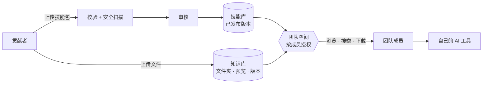
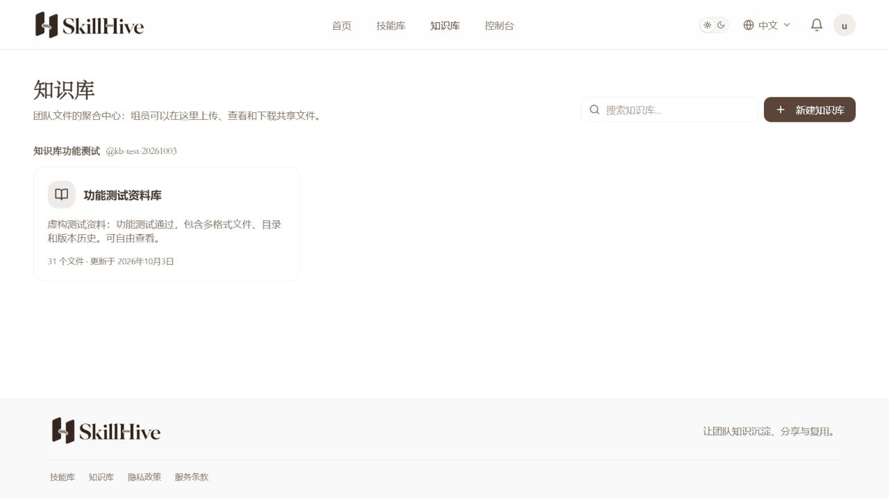
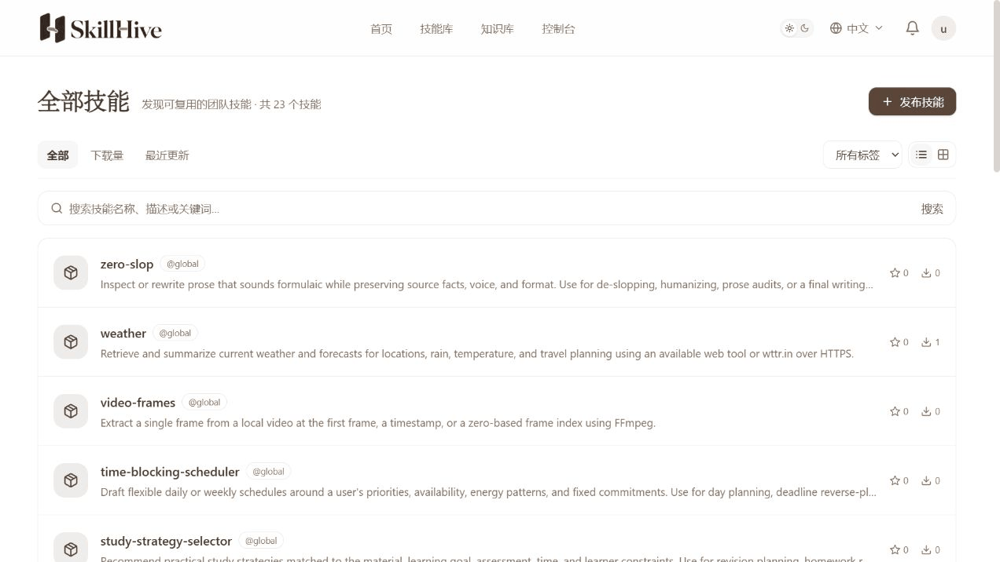
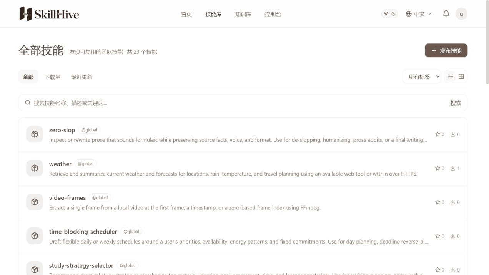
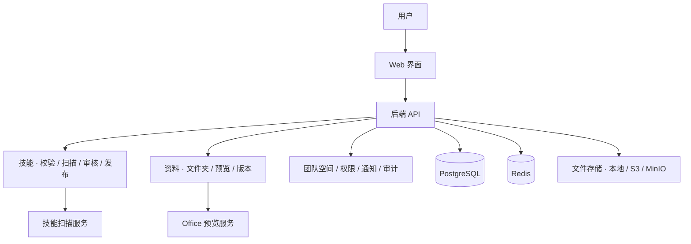

<p align="center">
  
</p>

<h3 align="center">私有部署的团队 AI 技能与资料共享中心</h3>

<p align="center">
  技能经审核再发布，资料上传即共享，<br />
  都放在同一个团队空间里，数据留在你自己的服务器上。
</p>

<p align="center">
  <a href="LICENSE"></a>
  
  
</p>

<p align="center">
  <strong>简体中文</strong> · <a href="README.en.md">English</a>
  <br />
  <a href="#为什么选择-skillhive">为什么选择</a> · <a href="#在线体验">在线体验</a> · <a href="#产品演示">产品演示</a> · <a href="#功能一览">功能一览</a> · <a href="#部署">部署</a> · <a href="#开发与文档">开发与文档</a>
</p>

## 为什么选择 SkillHive

<table>
  <tr>
    <td width="33%" valign="top">
      <strong>私有部署，数据不出团队</strong><br /><br />
      用 Docker Compose 部署在自己的服务器或内网，文件可存放在本地磁盘、S3 或 MinIO。线上演示站运行在一台 2 核 4 GB 的服务器上。
    </td>
    <td width="33%" valign="top">
      <strong>技能先审核，再进团队</strong><br /><br />
      技能包上传后要经过结构与元数据校验、<a href="https://github.com/cisco-ai-defense/skill-scanner">Cisco AI Skill Scanner</a> 安全扫描和人工审核，通过后才会发布，减少带风险的脚本流入团队。
    </td>
    <td width="33%" valign="top">
      <strong>方法和资料，一处取用</strong><br /><br />
      团队空间页同时列出该空间的技能和知识库，还能跨知识库搜索文件。“怎么做”和“用什么做”，在同一个入口找到。
    </td>
  </tr>
  <tr>
    <td valign="top">
      <strong>资料能预览，改动可回溯</strong><br /><br />
      PDF、图片、Markdown（含配图）在线查看，Word / PowerPoint 预览前五页。每次更新都保留版本，可下载或恢复历史版本。
    </td>
    <td valign="top">
      <strong>权限细到每位成员</strong><br /><br />
      在空间角色之外，可为每位成员单独设置只读或可编辑，以及是否允许下载，调整后立即生效。关键操作都记入审计日志。
    </td>
    <td valign="top">
      <strong>不绑定任何 AI 工具</strong><br /><br />
      技能采用通用的 <code>SKILL.md</code> 格式。成员下载后交给自己习惯的 AI 工具使用，平台本身不执行技能脚本。
    </td>
  </tr>
</table>

### 和常见做法比一比

| | 群聊、网盘、个人笔记 | SkillHive |
| --- | --- | --- |
| 好用的 AI 技能 | 散落在聊天记录里，不知道哪个是最新版 | 集中存放，附说明、版本和下载量 |
| 技能是否安全 | 拿来直接用，没人检查 | 校验、安全扫描、人工审核后才发布 |
| 模板和资料 | 多处副本，难以确认哪份最新 | 统一入口，版本历史可回溯 |
| 找东西 | 翻聊天记录、问同事 | 按团队空间浏览，跨知识库搜索 |
| 谁能访问 | 链接一转发就能看 | 仅团队成员可见，下载权限单独控制 |
| 数据在哪 | 第三方平台 | 你自己的服务器 |

### 它是怎么工作的



举个例子：团队把“会议纪要整理”技能发布到技能库，把会议模板和项目资料放进知识库。新成员打开团队空间，就能同时找到这套方法和配套资料，下载后交给自己的 AI 工具完成工作。

## 在线体验

演示地址：**[https://skillhive.team](https://skillhive.team)**

在[登录页面](https://skillhive.team/login)使用下面任一账号登录。它们都是普通成员，只能看到各自有权限的团队资源。

| 用户名 | 密码 | 上传的技能 |
| --- | --- | --- |
| `curator_ui` | `Sh!7VoU_FOwrzDZFdcvPQiwuVzxOzyPcUsux` | `web-design-guidelines` |
| `curator_database` | `Sh!78xMg-9z_LvslyHrCWazr1zB30gCtwi2W` | `supabase-postgres-best-practices` |
| `curator_content` | `Sh!7jspLLunXXasAgMlo-vXz1pc9ANLeeaTx` | `baoyu-markdown-to-html` |
| `curator_ai` | `Sh!7x0hZiBWJ_8teeVCdT1NMMEEAtUFVa73u` | `huggingface-gradio` |

## 产品演示

### 找到资料，预览并查看版本

从知识库进入文件夹，打开文档预览，再查看和下载需要的历史版本。



<details>
<summary><strong>查看技能说明、包内文件和已发布版本</strong></summary>

在技能库找到技能，阅读说明，切换到包内文件预览 `SKILL.md`，再查看已发布版本。



</details>

<details>
<summary><strong>发布技能：选择团队空间和可见范围</strong></summary>

从技能库点击“发布技能”，选择目标空间和可见范围，再上传技能包。提交的版本经过校验、安全扫描和审核后发布。



</details>

以上动图录自本地 Web 界面，知识库资料为虚构的测试资料。

## 功能一览

| 模块 | 能做什么 |
| --- | --- |
| **技能库** | 上传含 `SKILL.md` 的技能包；查看说明、包内文件和版本历史；校验、安全扫描、审核后发布；收藏、评分、订阅；按关键词、标签和排序浏览；下架与隐藏。 |
| **知识库** | 多层文件夹；批量上传、进度查看与失败重试；Markdown 可连同本地图片或整个文件夹上传；在线预览；版本历史、指定版本下载与恢复；按标题和描述搜索，可跨知识库。 |
| **团队空间** | 一个页面同时展示空间内的技能和知识库；成员管理，按成员设置只读、可编辑和下载权限，调整即时生效。 |
| **治理** | 平台角色与空间角色；业务通知；关键操作审计日志。 |
| **界面** | 中文、English、Русский；浅色 / 深色主题；适配手机和窄屏。 |

<details>
<summary><strong>技能包格式</strong></summary>

技能包以 `SKILL.md` 描述名称、用途和执行指令，可以附带脚本、参考材料和配套资源。

```text
meeting-notes/
├── SKILL.md
├── references/    # 参考材料（可选）
├── scripts/       # 脚本（可选）
└── assets/        # 配套资源（可选）
```

`SKILL.md` 示例：

```markdown
---
name: meeting-notes
description: 整理会议记录，提取讨论结论与后续待办。
---

# 会议记录整理

阅读输入的会议记录，按讨论主题整理结论，并列出待办事项、负责人和期限。
```

技能版本经过校验、扫描和审核后发布。检索和下载只使用已发布版本，访问仍受权限控制。

</details>

<details>
<summary><strong>支持的知识文件</strong></summary>

资料按 **团队空间 → 知识库 → 文件夹 → 文件** 组织，单个文件上限 **100 MiB**。

| 文件类型 | 支持格式 | 取用方式 |
| --- | --- | --- |
| PDF | `.pdf` | 在线预览、下载原文件。 |
| 图片 | `.png`、`.jpg`、`.jpeg`、`.gif`、`.webp` | 在线预览、下载原文件。 |
| Markdown / 文本 | `.md`、`.markdown`、`.txt` | 在线阅读；Markdown 支持连同本地图片上传与展示。 |
| Word / PowerPoint | `.doc`、`.docx`、`.ppt`、`.pptx` | 启用 Office 预览服务后查看前五页，或下载原文件。 |
| 表格 / 数据 | `.xls`、`.xlsx`、`.csv`、`.json` | 上传、下载与版本管理。 |
| 压缩包 | `.zip`、`.rar`、`.7z` | 上传、下载与版本管理。 |

知识文件上传成功即可供有权限的成员访问，默认不向匿名用户开放。Office 预览以页面图片展示，排版可能与 Microsoft Office 略有差异；服务未启用或生成失败时可下载原文件。配置见 [Office 预览说明](office-preview/README.md)。

</details>

**边界说明**：SkillHive 通过 Web 管理资源，不在平台内执行技能脚本。知识文件搜索匹配标题和描述（标题默认取自文件名），不检索正文，也不提供文档解析、向量检索、RAG 问答或在线协同编辑。

## 部署

SkillHive 面向在自己环境中部署的团队。所有服务都以容器运行：

| 服务 | 作用 |
| --- | --- |
| Web 与后端 API | 界面与业务逻辑（React / Spring Boot） |
| 技能扫描服务 | 技能包安全扫描 |
| PostgreSQL、Redis | 数据与缓存 |
| 文件存储 | 本地磁盘、S3 或 MinIO |
| Office 预览服务（可选） | Word / PowerPoint 页面预览 |

线上演示站在一台 2 核 4 GB 的服务器上运行全部服务，各服务设置了内存上限。这一配置尚未做并发容量测试，团队人数较多时请按实际负载评估。

| 仓库内配置 | 用途 |
| --- | --- |
| [部署配置](skillhub-docs/09-deployment.md) | 认证、数据库、存储与环境变量配置。 |
| [.env.release.example](.env.release.example) | 运行参数模板，部署时复制为 `.env.release` 并修改。 |
| [compose.release.yml](compose.release.yml) | 前端、后端、扫描器、数据库与 Redis 的容器编排。 |
| [compose.office-preview.yml](compose.office-preview.yml) | 按需加入 Word / PowerPoint 预览服务。 |

部署配置中的默认镜像地址需要替换为由本仓库源码构建的镜像，默认镜像并不是 SkillHive 的发布版本。完成镜像、账户、存储和密钥配置后，再按部署文档启动服务。

## 开发与文档

### 系统架构



前端使用 **React 19、TypeScript、Vite 与 TanStack Query**，后端使用 **Java 21、Spring Boot 与 Maven 多模块**。技能扫描服务使用 Python，Office 预览服务使用 LibreOffice、Poppler 与 Python。

技能与知识文件拥有独立的领域模型，共享用户、团队空间、对象存储和治理设施。后端按控制器、应用服务与领域服务划分职责，前端通过生成的 OpenAPI 类型保持接口一致。

### 常用开发命令

在具备开发依赖的 Linux / WSL 环境中，于仓库根目录执行：

| 命令 | 用途 |
| --- | --- |
| `make test-backend-app` | 测试后端应用模块及其依赖。 |
| `make typecheck-web` | 检查前端 TypeScript 类型。 |
| `make lint-web` | 检查前端代码规范。 |
| `make test-frontend` | 运行前端单元测试。 |
| `make build-frontend` | 构建前端生产资源。 |
| `make generate-api` | 从运行中的后端生成前端 OpenAPI 类型。 |

后端接口契约改变后运行 `make generate-api`，不要手工修改 `web/src/api/generated/schema.d.ts`。数据库变更只新增 Flyway 迁移，不修改既有迁移。发布前需进行容器回归，覆盖技能发布与下载、知识文件权限、上传、预览和版本操作。更新日志的维护方式见 [更新日志维护](skillhub-docs/changelog-maintenance.md)。

### 扩展方向

开放 API 与 CLI 接入属于后续规划，具体能力以未来的更新日志为准。现有后端 API 服务于 Web 界面，尚未作为完整的开放 API 发布，API Token 管理入口暂时隐藏。

## 致谢

感谢 [iflytek/skillhub](https://github.com/iflytek/skillhub) 提供的开源源码基础，以及 [Tencent/WeKnora](https://github.com/Tencent/WeKnora) 在知识管理组织、交互与文档展示方面提供的参考。

## 许可证

本项目采用 **Apache License 2.0**，保留相关版权与许可声明，完整条款见 [LICENSE](LICENSE)。第三方依赖及资源遵循各自的许可证。
