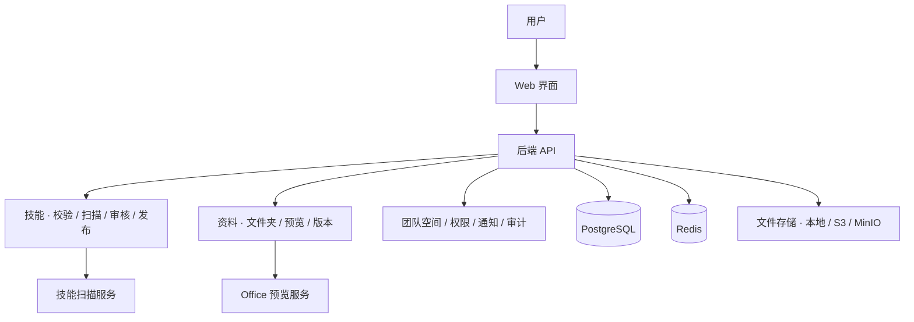

<p align="center">
  
</p>

# SkillHive

**简体中文** · [English](README.en.md)

**团队 AI 技能与工作资料的共享中心。**

把做事的方法和所需的资料留在团队里。

[](LICENSE)


[了解产品](#方法与资料各归其位) · [产品演示](#产品演示) · [主要功能](#主要功能) · [部署说明](#部署说明) · [开发与文档](#开发与文档)

## 方法与资料，各归其位

| 放什么 | 怎么管理 | 为团队解决什么问题 |
| --- | --- | --- |
| **技能库存方法** | 上传 AI 技能包，查看说明与包内文件，经过校验、扫描和审核后发布。 | 整理会议记录、撰写报告、处理文件等做法可以共享，成员取用已发布的版本。 |
| **知识库存资料** | 按多层文件夹整理模板、制度、文档和表格，支持上传、预览、下载与版本历史。 | 常用资料有统一入口，更新有记录，需要时可取回历史版本。 |
| **团队空间管权限** | 技能与知识库共用空间和成员管理，按角色与资源可见范围控制访问。 | 明确谁能访问、谁能发布、谁能管理，关键操作有记录可查。 |

例如，团队把“会议纪要整理”技能放入技能库，把会议模板和项目资料放入知识库。新成员从同一个网站找到方法和资料，下载后交给自己使用的 AI 工具完成工作。

**SkillHive 管理资源，成员使用自己的 AI 工具执行任务。**

## 产品演示

### 找到资料，预览并查看版本

从知识库进入文件夹，打开文档预览，再查看和下载需要的历史版本。


<details>
<summary><strong>查看技能说明、包内文件和已发布版本</strong></summary>

在技能库找到技能，阅读说明，切换到包内文件预览 `SKILL.md`，再查看已发布版本。


</details>

<details>
<summary><strong>发布技能：选择团队空间和可见范围</strong></summary>

从技能库点击“发布技能”，选择目标空间和可见范围，再上传技能包。提交的版本需经过校验、安全扫描和审核后发布。


</details>

以上动图录自本地 Web 界面。知识库资料为虚构测试资料；发布演示展示入口与表单设置。

## 适合哪些团队

- **已经在使用 AI 工具，希望共享好方法。** 将常用技能包集中管理，让成员查看说明并下载已发布版本。
- **模板和项目资料分散，希望建立统一入口。** 用文件夹组织原文件，按权限共享，持续维护版本。
- **有多人协作和管理要求。** 用团队空间划分资源，结合技能审核、通知与审计管理发布和更新。

SkillHive 的侧重点是把 **技能包与工作资料放进同一套团队空间和权限体系**，并为两类资源提供各自合适的管理流程：技能经过校验、扫描和审核后发布，知识文件上传成功即可按权限共享。

## 主要功能

| 能力 | 说明 |
| --- | --- |
| 技能管理 | 上传包含 `SKILL.md` 的技能包，查看说明、包内文件和版本历史，下载已发布版本；按关键词、标签和排序浏览。 |
| 技能发布与治理 | 包结构及元数据校验、安全扫描、版本审核与发布，支持下架、隐藏等管理操作。 |
| 知识库与文件夹 | 在团队空间下建立知识库，用多层文件夹组织资料，维护文件标题、描述与所属目录。 |
| 文件上传与取用 | 批量上传、进度查看与失败重试；按标题、描述和文件名查找，结合文件夹、类型和排序浏览。 |
| 预览与版本 | 预览支持的文件格式，下载原文件；上传新版本、查看历史版本、下载指定版本及恢复历史版本。 |
| 团队权限与追溯 | 管理空间及成员，通过平台角色、空间角色和资源可见范围控制操作；提供业务通知与关键操作审计。 |

### 技能包：共享做事的方法

技能包以 `SKILL.md` 描述名称、用途和执行指令，可以附带脚本、参考材料和配套资源。

```text
meeting-notes/
├── SKILL.md
├── references/    # 参考材料（可选）
├── scripts/       # 脚本（可选）
└── assets/        # 配套资源（可选）
```

`SKILL.md` 示例：

```markdown
---
name: meeting-notes
description: 整理会议记录，提取讨论结论与后续待办。
---

# 会议记录整理

阅读输入的会议记录，按讨论主题整理结论，并列出待办事项、负责人和期限。
```

技能版本经过校验、扫描和审核后发布，普通检索与下载使用已发布版本，访问仍受权限控制。

### 知识文件：保存原文件，持续维护版本

资料按 **团队空间 → 知识库 → 文件夹 → 文件** 组织。单个文件上传上限为 **100 MiB**。

| 文件类型 | 支持格式 | 取用方式 |
| --- | --- | --- |
| PDF | `.pdf` | 在线预览、下载原文件。 |
| 图片 | `.png`、`.jpg`、`.jpeg`、`.gif`、`.webp` | 在线预览、下载原文件。 |
| Markdown / 文本 | `.md`、`.markdown`、`.txt` | 在线阅读；Markdown 支持配套本地图片上传与展示。 |
| Word / PowerPoint | `.doc`、`.docx`、`.ppt`、`.pptx` | 启用 Office 预览服务后查看前五页，或下载原文件。 |
| 表格 / 数据 | `.xls`、`.xlsx`、`.csv`、`.json` | 上传、下载与版本管理。 |
| 压缩包 | `.zip`、`.rar`、`.7z` | 上传、下载与版本管理。 |

知识文件上传成功即可供有权限的成员访问，默认不向匿名用户开放。Office 预览以页面图片展示，排版可能与 Microsoft Office 存在差异；服务未启用或生成失败时可下载原文件。配置见 [Office 预览说明](office-preview/README.md)。

### 使用范围

SkillHive 通过 Web 提供资源管理，不在平台内执行技能脚本。知识文件查找匹配标题、描述和文件名，不搜索正文，也不提供文档解析、向量检索、RAG 问答或在线 Office 协同编辑。成员可以将下载的资源交给自己选用的工具处理。

## 部署说明

SkillHive 可在团队自己的环境中部署，前端、后端、扫描器、数据库及 Redis 可通过 Docker 运行；Word / PowerPoint 预览使用独立的 Office 预览服务。

### 新环境部署

部署前准备 Docker Engine 与 Docker Compose，并根据环境配置访问地址、登录方式、初始管理员和文件存储。

| 仓库内配置 | 用途 |
| --- | --- |
| [部署配置](skillhub-docs/09-deployment.md) | 查看认证、数据库、存储与环境变量配置。 |
| [.env.release.example](.env.release.example) | 运行参数模板，部署时复制为 `.env.release` 并修改。 |
| [compose.release.yml](compose.release.yml) | 前端、后端、扫描器、数据库与 Redis 的容器编排。 |
| [compose.office-preview.yml](compose.office-preview.yml) | 按需加入 Word / PowerPoint 预览服务。 |

部署配置中的默认镜像地址需要替换为与本仓库源码对应的镜像，不能将默认镜像直接视为 SkillHive 的发布版本。完成镜像、账户、存储和密钥配置后，再按部署文档启动服务。

## 开发与文档

### 系统架构



前端使用 **React 19、TypeScript、Vite 与 TanStack Query**，后端使用 **Java 21、Spring Boot 与 Maven 多模块**。技能扫描服务使用 Python，Office 预览服务使用 LibreOffice、Poppler 与 Python。

技能与知识文件拥有独立的领域模型，共享用户、团队空间、对象存储和治理设施。后端按控制器、应用服务与领域服务划分职责，前端通过生成的 OpenAPI 类型保持接口一致。

### 常用开发命令

在具备开发依赖的 Linux / WSL 环境中，于仓库根目录执行：

| 命令 | 用途 |
| --- | --- |
| `make test-backend-app` | 测试后端应用模块及其依赖。 |
| `make typecheck-web` | 检查前端 TypeScript 类型。 |
| `make lint-web` | 检查前端代码规范。 |
| `make test-frontend` | 运行前端单元测试。 |
| `make build-frontend` | 构建前端生产资源。 |
| `make generate-api` | 从运行中的后端生成前端 OpenAPI 类型。 |

后端接口契约改变后运行 `make generate-api`，不要手工修改 `web/src/api/generated/schema.d.ts`。数据库变更只新增 Flyway 迁移，不修改既有迁移。发布前需进行容器回归，覆盖技能发布与下载、知识文件权限、上传、预览和版本操作。

### 扩展方向

开放 API 与 CLI 接入属于后续规划，具体能力以未来发布说明为准。现有后端 API 服务于 Web 界面，尚未作为完整的用户开放 API 发布，API Token 管理入口暂时隐藏。

## 致谢

感谢 [iflytek/skillhub](https://github.com/iflytek/skillhub) 提供的开源源码基础，以及 [Tencent/WeKnora](https://github.com/Tencent/WeKnora) 在知识管理组织、交互与文档展示方面提供的参考。

## 许可证

本项目采用 **Apache License 2.0**，保留相关版权与许可声明，完整条款见 [LICENSE](LICENSE)。第三方依赖及资源遵循各自的许可证。
